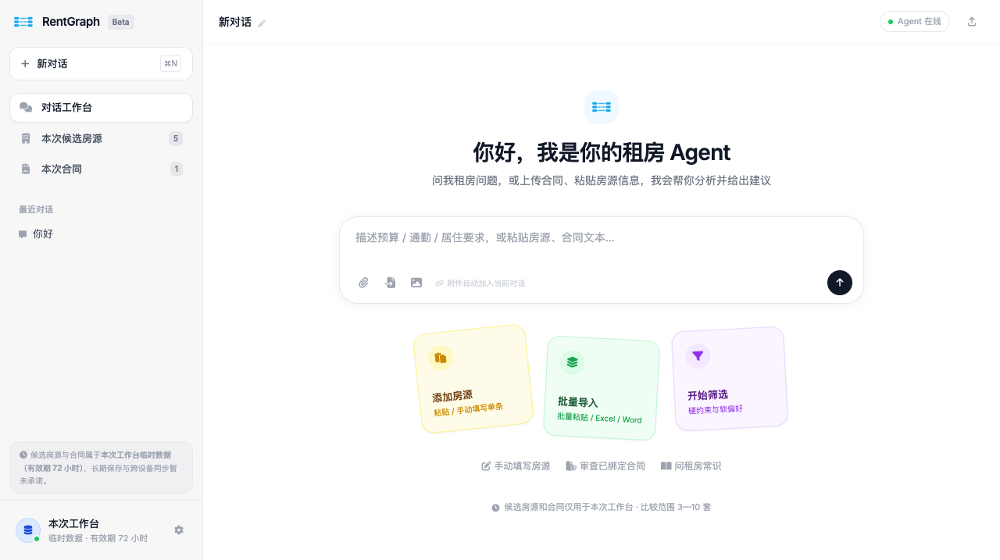
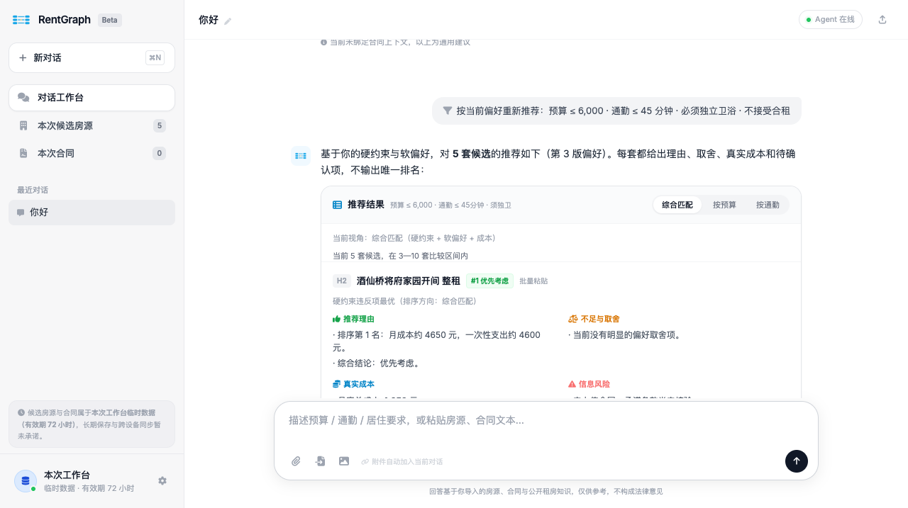
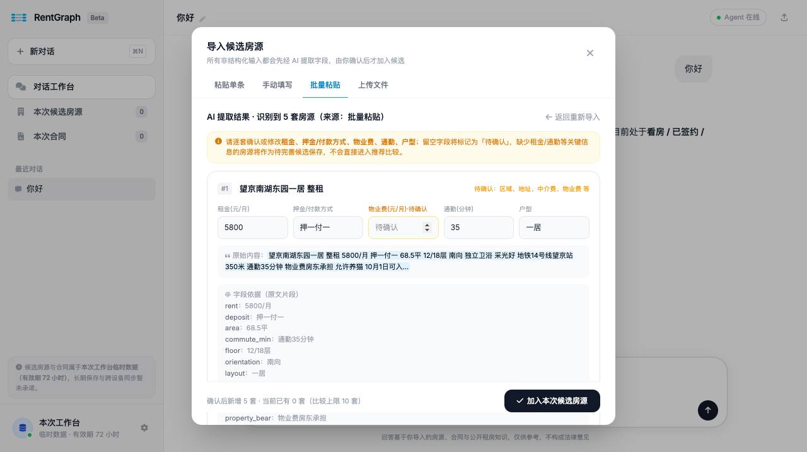
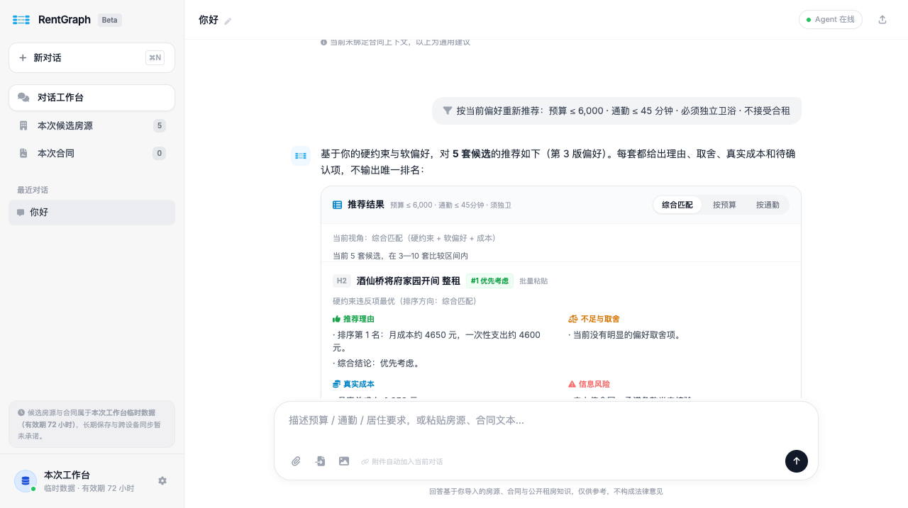
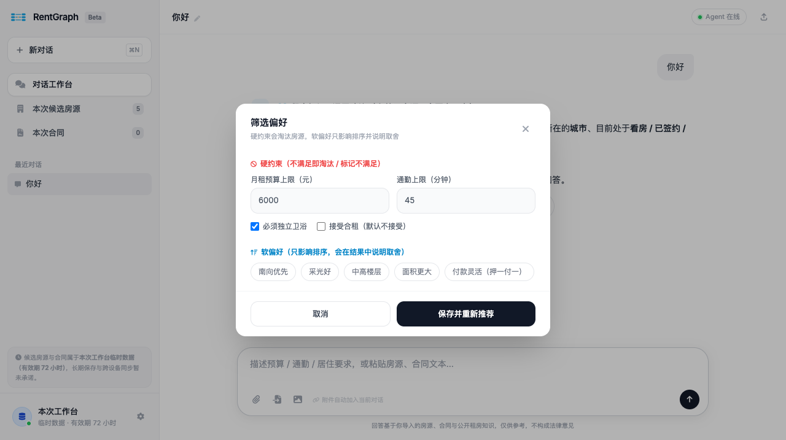
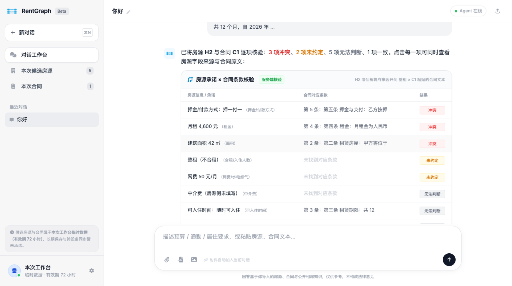
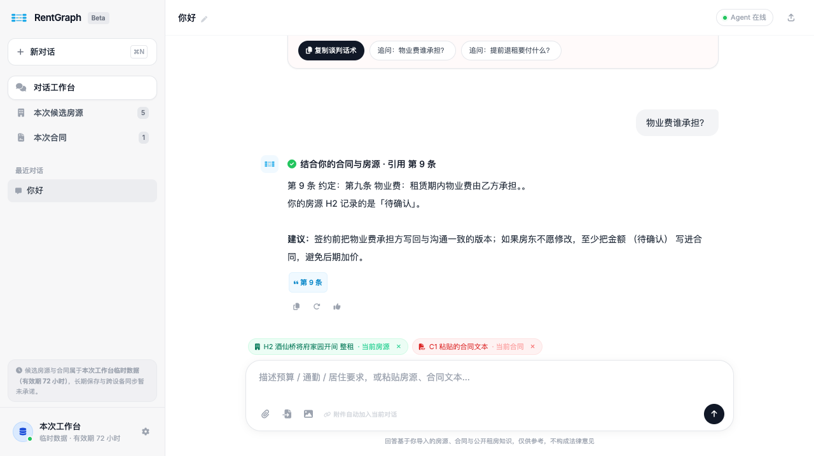
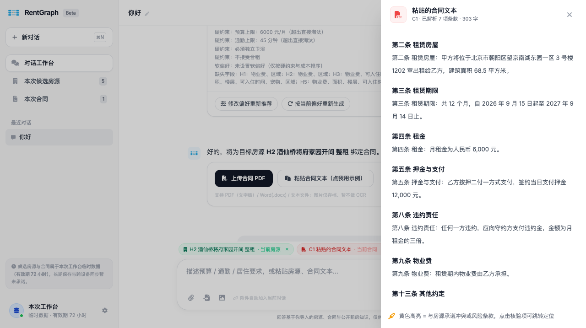

<div align="center">
  
  <h1>RentGraph · 租房决策工作台</h1>
  <p><strong>把「房东怎么说的」和「合同怎么写的」逐条对上，再决定签不签。</strong></p>
  <p>
    
    
    
    
    
    
    
  </p>
  <p>
    <a href="#快速开始">快速开始</a> ·
    <a href="#三条-p0-流程">三条流程</a> ·
    <a href="doc/plan/后端-v1.1-接口契约.md">接口契约</a> ·
    <a href="evals/checklist-v11.md">验收清单</a> ·
    <a href="evals/report-v11-llm.md">真实模型评测报告</a>
  </p>
</div>

---



## 它解决什么问题

租房踩坑，绝大多数不是"信息不够"，而是**信息对不上**：中介口头说"物业费房东出、押一付一、可以养猫"，合同里写的是"物业费乙方承担、押二付一、禁止饲养宠物"。人不会逐条比对几十项，但机器可以。

RentGraph 是一个单机可跑的租房决策工作台：把候选房源（粘贴文本 / Excel / Word / PDF）结构化，按**硬约束淘汰 + 软偏好排序**给出可解释推荐，再把**房源侧的每一条承诺**与**合同条款**逐项核验，最后用一个带**引用约束**的问答 Agent 回答追问。

它同时有三条刻意的"不承诺"（产品底线，写进 PRD 与测试）：

| 不承诺 | 表现 |
|---|---|
| 不承诺房源真实有效 | 只展示"来源 + 完整性 + 缺失字段"，不写"已验证房源""平台认证" |
| 不输出法律结论 | 条款冲突只给"风险提示与谈判话术"，并明确"不构成法律结论" |
| 未匹配条款必须判「未约定」 | 合同里没有对应条款时不得写"一致"，只能是 `未约定` / `无法判断` |

## 界面

<table>
<tr>
<td width="50%"></td>
<td width="50%"></td>
</tr>
<tr>
<td align="center">候选房源推荐：可解释排序（推荐理由 / 取舍 / 真实成本 / 信息风险）</td>
<td align="center">导入确认：AI 抽字段，但<b>每个字段都附原文片段</b>由你确认</td>
</tr>
<tr>
<td></td>
<td></td>
</tr>
<tr>
<td align="center">候选房源：完整性、缺失字段、月度总成本一眼可见</td>
<td align="center">筛选偏好：硬约束（超限即淘汰）与软偏好分开</td>
</tr>
<tr>
<td></td>
<td></td>
</tr>
<tr>
<td align="center">核心能力：房源承诺 × 合同条款逐项核验，判定冲突/未约定/无法判断</td>
<td align="center">问答必须带条款引用；引不到就降级为通用建议</td>
</tr>
</table>



<p align="center"><sub>合同解析：条号、条款原文、字符区间都落库，供核验与问答引用</sub></p>

## 三条 P0 流程

**① 候选房源导入与字段确认**
粘贴任意格式（微信聊天、Excel、Word、PDF 文字版）→ LLM 抽取 → **草稿态等你确认**（每个字段可改、附原文依据、可疑为空的字段标 `待确认`）→ 确认后才进候选池。重复房源自动识别并跳过。

**② 可解释推荐（三视图）**
硬约束（预算 / 通勤 / 独卫 / 合租）超出直接淘汰并在结果里说明原因；软偏好只影响排序且必须写明取舍。排序结果附四块内容：`推荐理由`（排名依据 + 综合结论）、`不足与取舍`、`真实成本`（月度总成本 / 一次性支出）、`信息风险`（未绑合同就明确写"承诺条款尚未核验"）。

**③ 承诺 × 合同核验 + 上下文问答**
把某套房源设为目标 → 绑定合同（PDF / Word / 粘贴文本）→ 逐项判定 `冲突` / `一致` / `未约定` / `无法判断`，每项都能同时看到房源字段来源与合同原文片段，并生成可复制给房东的谈判话术。之后所有追问（"物业费谁承担？"）都强制带条款引用，引用不存在的条号会被剔除并把语气降级。

## 快速开始

```bash
# 后端：默认 SQLite + LLM_PROVIDER=mock，完全离线可跑
cd server
uv venv .venv --python 3.11 && uv pip install -e ".[dev]"   # 首次
./.venv/bin/python -m uvicorn rentgraph.main:app --port 8010

# 前端（dev server 已把 /api、/healthz 代理到 8010）
cd web
pnpm install && pnpm dev                                     # http://localhost:5173
```

接真实模型（可选，用于真解析 / 真核验 / 真问答）：

```bash
cd server && cp .env.example .env
# LLM_PROVIDER=openai
# LLM_BASE_URL=<任意 OpenAI 兼容端点>   LLM_API_KEY=...   LLM_MODEL=...
```

前端两种模式：

| 模式 | 命令 | 说明 |
|---|---|---|
| `api`（默认） | `pnpm dev` | 走真实后端；`VITE_API_MODE=api` |
| `demo` | `VITE_API_MODE=demo pnpm dev` | 纯前端演示数据，不需要后端（会显示"演示解析"标识） |

数据库：默认 `sqlite+aiosqlite:///./rentgraph.db`（已开 WAL + busy_timeout，并发读写不会 `database is locked`）；换 PostgreSQL 只需设 `DATABASE_URL=postgresql+asyncpg://...`，代码无需改动（`JSON.with_variant(JSONB)`）。

## 架构

```
web/ (React 19 + Tailwind 4 + Zustand)
  └─ src/api/  ← 手写类型化客户端：REST + SSE（/runs/{id}/events 分帧、断线重连、取消）
        │
        ▼  /api/v1
server/ (FastAPI 模块化单体)
  api/          9 个路由：workspaces · import-batches · houses · preferences
                recommendations · contracts · verifications · conversations · runs
  services/
    engine.py       流程门面
    flows/          import / recommend / contract / verify / chat 五条流程
    domain.py       成本、硬约束、排序（确定性计算，LLM 不参与）
    verify_rules.py 承诺 × 条款比对规则（确定性）
    llm/            Pydantic 契约 + prompt + mock(确定性) + 净化/引用校验
    runs.py         运行总线：事件、订阅、Last-Event-ID 重放、取消（节点边界）
  models.py        14 张表：workspaces / import_batches / houses / house_evidence / preferences /
                   contracts / clauses / risks / verifications / verification_items /
                   recommendation_runs / conversations / messages / runs
```

关键设计决策：

- **确定性核心算，LLM 只解释**：金额、排序、硬约束、条款比对全部由 `domain.py` / `verify_rules.py` 计算；LLM 输出的数字必须能在计算结果里找到依据（`ground_numbers`），否则判失败。
- **不静默降级**：模型失败 → `LLM_UNAVAILABLE`（503），绝不返回正则伪造的"分析完成"；`LLM_PROVIDER` 只认 `mock` / `openai`，未知取值直接报错。
- **HTML 白名单净化**：合同原文与模型输出都会被净化（只放行 `p/br/b/span/ul/li...` 与 `class`），前端不执行任何模型给的脚本/样式。
- **SSE 运行总线**：`fastapi.sse` 原生编码 + 15s 心跳，事件信封 `progress|token|interrupt|done|error|cancelled`，支持 `Last-Event-ID` 重放；单进程内存实现（换 ARQ/Redis 只需替换 `RunManager`）。

## 接口

29 个路径 / 38 个操作（完整契约见 [doc/plan/后端-v1.1-接口契约.md](doc/plan/后端-v1.1-接口契约.md)）：

| 分组 | 端点 | 作用 |
|---|---|---|
| workspaces | `POST /workspaces`、`GET /workspaces/{id}`、`PUT /workspaces/{id}/ctx` | 工作台（72h TTL）与上下文（当前房源 / 当前合同） |
| import-batches | `POST /import-batches`、`/upload`、`GET /{id}`、`POST /{id}/confirm`、`/cancel` | 房源导入：草稿 → 用户确认 → 落库 |
| houses | `GET/POST /houses`、`GET/PATCH/DELETE /houses/{id}`、`POST /{id}/evidence` | 候选房源（上限 10 套）与字段依据 |
| preferences | `GET/PUT /preferences` | 硬约束与软偏好 |
| recommendations | `POST /recommendations`、`GET /recommendations`、`GET /{id}` | 推荐运行与快照（推荐理由 / 取舍 / 成本 / 风险） |
| contracts | `POST /contracts`、`/upload`、`GET /{id}`、`/{id}/text`、`/{id}/retry`、`DELETE` | 合同解析为条款 + 风险项 |
| verifications | `POST /verifications`、`GET /{id}` | 承诺 × 条款逐项核验 |
| conversations | `POST /conversations`、`GET /{id}/messages`、`POST /{id}/messages` | 上下文问答（返回 `run_id`，流式输出） |
| runs | `GET /runs/{id}`、`POST /runs/{id}/cancel`、`GET /runs/{id}/events` | 统一运行状态与 SSE 事件流 |

错误码（`{error: {code, message, hint}}`）：`NO_TEXT_LAYER`（扫描件 PDF → 提示粘贴）、`DOC_UNSUPPORTED`、`TEXT_TOO_SHORT`、`TOO_MANY_HOUSES`、`OCR_UNSUPPORTED`（图片仅存档并明确报未支持）、`WORKSPACE_EXPIRED`（410）、`LLM_UNAVAILABLE`（503）。

## 测试与验收

```bash
cd server
./.venv/bin/python -m pytest -q                      # 132 passed，离线确定性（LLM_PROVIDER=mock + 临时 SQLite）
./.venv/bin/python scripts/acceptance_v11.py         # 42/42 端到端验收（mock）
./.venv/bin/python scripts/acceptance_v11.py --llm   # 42/42 端到端验收（真实模型 qwen，需 .env）
./.venv/bin/python -m ruff check src tests scripts   # lint
cd ../web && pnpm typecheck && pnpm build            # tsc --noEmit + vite build
```

| 层 | 覆盖 |
|---|---|
| 单元 / 集成 | 132 pytest：解析（txt/csv/md/xlsx/xls/pdf/扫描件）、领域计算、核验规则、LLM 契约、API 全流程、运行隔离 |
| 端到端 | 42 项验收：三条 P0 场景 + 工作台隔离 + 错误态 + 文案合规（禁止"真实有效 / 已验证房源 / 平台认证"等表述） |
| 视觉 | 前端与冻结原型逐屏像素对比（`租房知识图谱-Agent-Frontend-Protype.html`，目标 0px 偏差） |

真实模型评测报告：[evals/report-v11-llm.md](evals/report-v11-llm.md) · mock 报告：[evals/report-v11.md](evals/report-v11.md) · PRD 18 项证据表：[evals/checklist-v11.md](evals/checklist-v11.md)

## 一期边界（明确不做）

- **不做 OCR**：图片/扫描件只存档并明确报"暂不支持"，不伪造识别结果（实测当前可用 VL 通道会把合同内容编造成模板文字，接进来比不接更危险）。
- **不做真实语料评测**：核验规则目前在合成语料上验证，真实合同评测集待补。
- **不做账号体系与长期存储**：工作台 72 小时 TTL，跨设备同步未承诺。
- **不做图谱可视化 / 向量检索**：条款表已是图谱原料，迁移成本为零，二期再上。

## 文档

| 文档 | 内容 |
|---|---|
| [doc/prd/原型完善执行文档-v1.0.md](doc/prd/原型完善执行文档-v1.0.md) | 一期范围与验收基线（视觉/交互/文案） |
| [doc/prd/RentGraph-PRD-v2.md](doc/prd/RentGraph-PRD-v2.md) | 产品需求与边界 |
| [doc/arch/RentGraph-技术栈选型-2026.md](doc/arch/RentGraph-技术栈选型-2026.md) | 技术栈与架构决策 |
| [doc/plan/后端-v1.1-接口契约.md](doc/plan/后端-v1.1-接口契约.md) | 前后端事实源：端点、数据结构、SSE 信封、偏差记录 |
| [租房知识图谱-Agent-Frontend-Protype.html](租房知识图谱-Agent-Frontend-Protype.html) | 冻结的视觉与交互验收原型 |
| [server/README.md](server/README.md) · [web/README.md](web/README.md) | 各自的开发说明与目录导航 |

## 许可

仓库暂未附带开源许可协议；如需使用、分发或商用，请先联系作者。第三方依赖各自遵循其原始许可。
