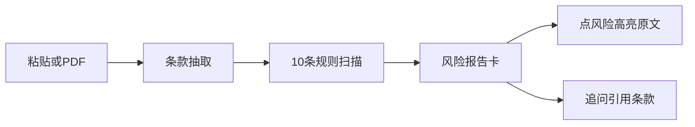

# 一期闭环：接下来完善什么

> 版本：v1.0 ｜ 日期：2026-09-08 ｜ 状态：已确认
>
> 上游：`doc/plan/一期方案-合同风险雷达.md`、`doc/plan/后端开发方案-server.md`
>
> 原则：**主链路已经接通，不要开新模块。** 只把演示脚本补完整、把评测从合成语料换成真实合同，并修掉会让闭环撒谎或中断的缺陷。

---

## 1. 现状判断

对照 [一期方案-合同风险雷达.md](一期方案-合同风险雷达.md) 的五步和演示脚本：

- **已接通**：粘贴 / PDF 上传 → SSE 进度 → 风险卡（等级、条号、健康度）→ 抽屉黄高亮 → 快捷指令追问。
- **文档写「已完成」但实际未达标**：评测 100% 来自合成模板；演示脚本第 1、5、6、7、8 步有缺口；几处错误会被静默吞掉。
- **明确不要做**：Neo4j、OCR、时间线、向量库、登录、规则扩到 40 条、会话持久化。这些会稀释唯一闭环。

后端方案 [后端开发方案-server.md](后端开发方案-server.md) §10 已经写明：当前数字只证明管线正确，不代表真实合同能力。这一点应作为下一阶段的核心。

---

## 2. 第一优先：演示脚本不能断、不能撒谎

目标：按一期方案 §8 走一遍，每一步都真。

### 2.1 上传失败要可见

[`web/src/api/generated/rentGraphAPI.ts`](../../web/src/api/generated/rentGraphAPI.ts) 不检查 `res.ok`。扫描件 PDF 返回 422 `NO_TEXT_LAYER` 时，前端会把错误体当 `ContractOut`，接着对 `undefined` 调 analyze。方案要求「提取失败即引导粘贴」目前走不到。

改 orval mutator / 统一 fetch：非 2xx 抛错，把 `NO_TEXT_LAYER` 映射成「请粘贴文本」。

### 2.2 追问必须绑当前合同

[`web/src/stores/chatStore.ts`](../../web/src/stores/chatStore.ts) 调 chat 时不传 `contract_id`；[`server/src/rentgraph/api/chat.py`](../../server/src/rentgraph/api/chat.py) 退回「最新 done 合同」。多份合同时会答错对象。

首页点「审查刚上传的…」走 `reviewLatest` 是对的；在输入框粘贴同一句话会进问答，不是审查。演示脚本应明确：用快捷卡片，或放宽/加意图识别。

### 2.3 引用条款必须可点、必须存在

Chat 的 `[第N条]` 没有存在性校验；前端 cite 只是标题字符串，点不进抽屉。方案第 6 步「引用第 8 条原文」现在只是碰巧。

后端丢掉不存在的条号；前端把 cite 做成可点击 chip，复用 `openContract(id, clauseNo)`。

### 2.4 免责与能力文案对齐产品

「不构成法律意见」只在对话态底部（[`web/src/routes/Workbench.tsx`](../../web/src/routes/Workbench.tsx)），首页没有。首页还写「支持 Word」「数据仅自己可见」——Word 后端 415，鉴权未做。

首页固定免责；改成「PDF / TXT / 粘贴」；「仅自己可见」在无鉴权前删掉或改成「本机演示，未做登录隔离」。

### 2.5 抽取失败不要假装成功

[`server/src/rentgraph/services/extract.py`](../../server/src/rentgraph/services/extract.py) 里 LLM 异常 `except Exception: pass` 后静默走 `mock_extract`。演示时模型挂了，用户会看到一份「分析完成」的正则假结果。

生产路径应报 `error` SSE；mock 仅 `LLM_PROVIDER=mock`。

### 2.6 60 秒 SLA 留余量

评测 55.3s/份，几乎全在思考模型抽取。调用未关 `enable_thinking`。关思考或换非思考档，否则真实长合同会破 60 秒。

**本阶段验收**：扫描件 PDF 会提示粘贴；LLM 挂了会报失败而不是假报告；追问绑在当前合同且引用可点进抽屉。

---

## 3. 第二优先：把「可宣称的数字」做真

这是方案里和 demo 选手的分水岭，也是当前最大空洞。

| 方案要求 | 现状 |
|---|---|
| 20 份真实北/杭合同 + 人工标注 | [`evals/generate.py`](../../evals/generate.py) 16 个罐头片段拼 20 份，GT 随生成器打标 |
| 规则命中 recall ≥90%；端到端 P≥70% R≥80% | [`evals/report-llm.md`](../../evals/report-llm.md) 100% 是同分布自测 |
| 规则库约 40 条 + LLM 兜底 | 代码 10 条（对齐「先写 10 条」），无 LLM 风险判断 |

建议顺序：

1. 收集约 10–20 份脱敏真实合同（自如 / 中介 / 个人），替换 `evals/contracts/`，按 `(clause_no, rule_id)` 人工标 `ground_truth.json`。
2. **先不要扩到 40 条**。现有 10 条启发式在真实表述上会漏/误（如 `不得转租` 会误伤「未经同意不得转租」；`15天内` 打不中 `日内` 正则）。先对着真实 GT 修这 10 条。
3. 真实集上若某类 recall 明显塌（抽取 paraphrasing 被 `grounding_ok` 丢掉、或规则关键词覆盖不到），再加 **LLM 风险兜底**，且兜底结果仍必须挂已有 `clause_id`。
4. 对外只报真实集数字；合成 100% 留作回归冒烟。

**本阶段验收**：评测报告注明语料是真实还是合成；对外数字来自人工标注集。

---

## 4. 第三优先：闭环体验补完，仍不做新功能

这些不影响「能不能跑」，但演示脚本写了、现在是半成品。

- **谈判话术**：[RiskReportCard.tsx](../../web/src/components/RiskReportCard.tsx) 把 `suggestion` 拼成清单。方案要的是「发给房东的话术」（条号 + 替换文本）。`Risk` 模型没有 `negotiation_script`；可先用模板从 suggestion 生成，不必再调一次 LLM。
- **导出报告**：现在下 JSON。演示要可读文本（Markdown 即可，不必真 PDF）。
- **进度 checklist**：先画出「解析文档 / 抽取条款 / 匹配规则库」三行灰圈，再按 SSE 推进；现在是空列表等事件。
- **抽屉多风险**：[contracts.py `contract_text`](../../server/src/rentgraph/api/contracts.py) 用 `{clause_id: risk}` 覆盖，押金条款可命中 3 条规则，抽屉只留最后一条。应改为 `is_risk` + 风险列表。
- **侧栏**：硬编码「望京合同风险审查」「张三 / Pro」。一期可做成真实「我的合同」列表（已有 `GET /contracts`），最近对话保持空态或「当前会话」；不要做会话后端。
- **粘贴门槛**：前端要 ≥300 字且匹配 `第N条`，后端只要 50 字。无条号的真实合同会当问答发出去。门槛应与后端对齐，或明确失败提示。

**本阶段验收**：一期方案 §8 六步演示脚本可完整走通。

---

## 5. 明确延后（现在做会破坏「一条线」）

- JWT / 短信登录、slowapi 配额、alembic、聊天 SSE 流式、会话表
- 规则扩到 40、独立 `services/report.py` / `services/chat.py` 重构
- Word、OCR、多租户

鉴权可以等闭环演示和质量数字都站住后再做。现在文案诚实即可。

---

## 6. 实施顺序与检查点

| 阶段 | 做什么 | 检查点 |
|------|--------|--------|
| P0 | 错误处理 + 禁止静默 mock + 关 thinking + chat `contract_id` / 引用可点 / 免责文案 | 演示不翻车、不撒谎 |
| P1 | 话术模板、导出 Markdown、checklist、抽屉多风险、侧栏接合同列表、粘贴门槛 | 方案 §8 六步走通 |
| P2 | 真实合同 + 人工 GT + 打磨 10 条规则 | 可对外报数字 |
| P3 | 仅当真实集暴露规则覆盖不足时，再加 LLM 风险兜底 | 兜底必须 grounding 到 `clause_id` |

总验收：方案 §8 六步 + 扫描件 PDF 提示粘贴 + LLM 失败报错而非假报告 + 评测报告注明语料来源。